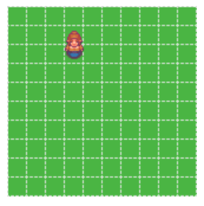

# HTML5 Canvas Gameboard

Seriously simple. Just plain ol' tiles n' units. You'll have to use other modules or build your own parts to run around this. See example.



## Get it

#### Installation
```bash
npm install gameboard
```

#### Building the example
Running the following will browserify example and open a browser window for you.
```bash
npm install && npm run example
```

## Usage
```javascript
var assets = require('./some-image-loader');
var GameBoard = require('gameboard');
var canvas = document.getElementById('gameCanvas');

var gameBoard = new GameBoard({
    canvas: canvas,
    tileSize: 16, // px
    width: 10, // in tiles
    height: 10, // in tiles
    FPS: 45,
    assets: assets,
    grid: true // really slows down performance
});

gameBoard.start();
```

## GameBoard([options])
Returns a new instance of GameBoard. You can init with tiles already and units in place already. Must supply canvas.
- `canvas` - **required**
- `tileSize` - optional (default: 16px)
- `FPS` - optional (default: 30)
- `assets` - optional (see **Assets** below)
- `grid` - (default false)

## GameBoard.draw()
Draws the gameBoard without kicking off the render loop.

## GameBoard.clear()
Clears the game board.

## GameBoard.start()
Kicks off the `render()` which calls `clear()` and `draw()` at rate of `GameBoard.FPS`. It is limited by `requestAnimationFrame`.

## GameBoard.tileUpdate(tiles)
Best way to update the gameBoard. Tiles get parsed through, units pulled out of the individual tiles, sorted and put into `GameBoard.units`. Tiles are then rendered in the `render()` loop. If not in the `render()` loop, you can call draw() after.e
```javascript
var newUnit = {
    style: 'woman',
    size: [1,2],
    location: { x: 0, y: 0 }
};

var tiles = [
    {
        location: { x: 0, y: 0 },
        style: 'grass_a',
        visible: true,
        units: [newUnit]
    },
    {
        location: { x: 1, y: 0 },
        style: 'grass_a',
        visible: true,
        units: []
    }
];

gameBoard.tileUpdate(tiles);
```

## GameBoard.addTile(tile)
Convenience method to directly draw a tile to canvas.
If `render()` loop is active, tile will be added to `GameBoard.tiles`.

## GameBoard.addUnit(unit)
Convenience method to directly draw a unit to canvas. If `render()` loop is active, unit will be added to `GameBoard.units`.

## Tile

```javascript
{
    location: [object],
    style: 'string',
    visible: 'boolean',
    units: 'array'
}

```
- `location` is an object with x and y.
- `units` is an array of `Unit` objects (see below)
- `visible` boolean value. Invisible tiles won't be drawn.
- `units` is an array of `Unit` objects.

## Unit

```javascript
{
    style: 'string',
    size: ['xSize', 'ySize'],
    location: [object]
}
```
- `location` is an object with x and y.
- `size` defines how many tiles it occupies. (i.e [1,2] would be a unit 1 tile wide, 2 tiles tall.)
- `style` is how the GameBoard accesses the sprite.


## Assets
Assets can be kind of annoying. You have to load them up before you start trying to draw them.

```javascript
var woman = new Image();
var grassland = new Image();
woman.src = '../assets/characters/woman.png';
grassland.src = '../assets/terrain/grassland_a.png';

var assets = {
    woman: woman,
    grass_a: grassland
};

var GameBoard = require('../index');
var canvas = document.getElementById('gameCanvas');

var gameBoard = new GameBoard({
    canvas: canvas,
    tiles: {},
    tileSize: 16,
    width: 10,
    height: 10,
    assets: assets // providing the actual Image(s) here.
});
```
The GameBoard will be accessing your assets by its `style` attribute.

For example, if `unit.style` is `'woman'`, the GameBoard will search through its `assets` hash for `GameBoard.assets['woman']`, which will reference your sprite!
